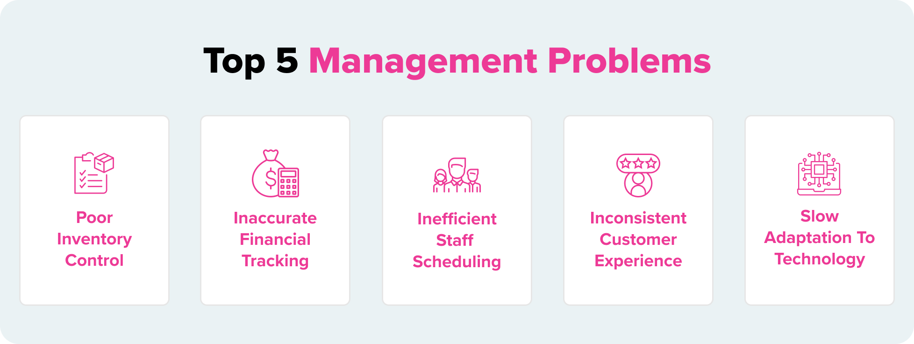
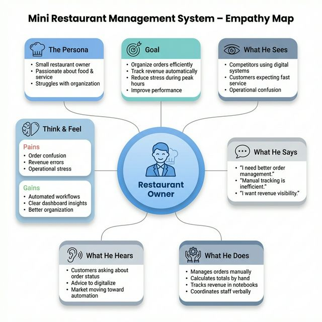
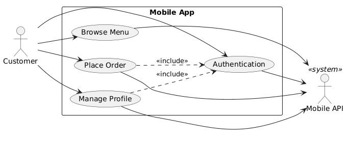
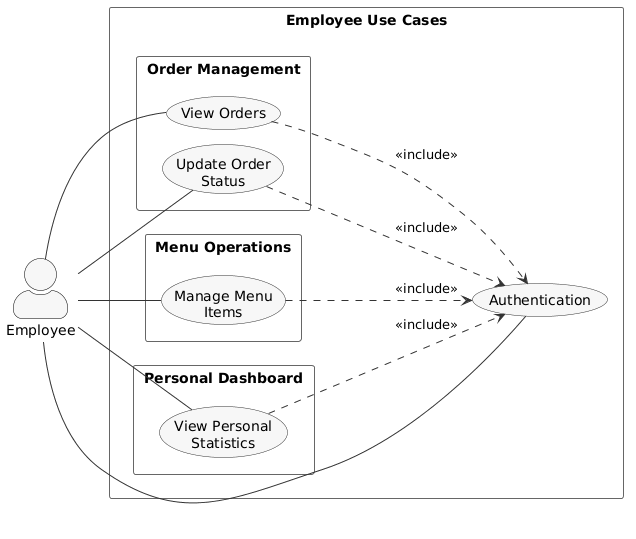
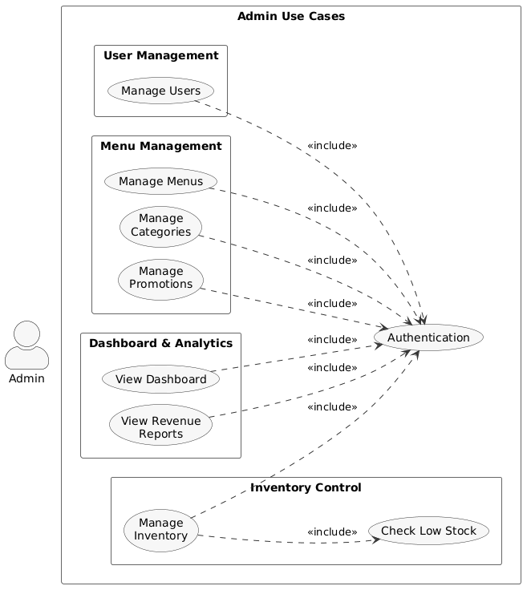
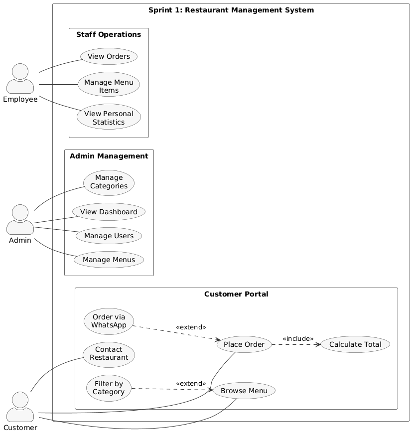
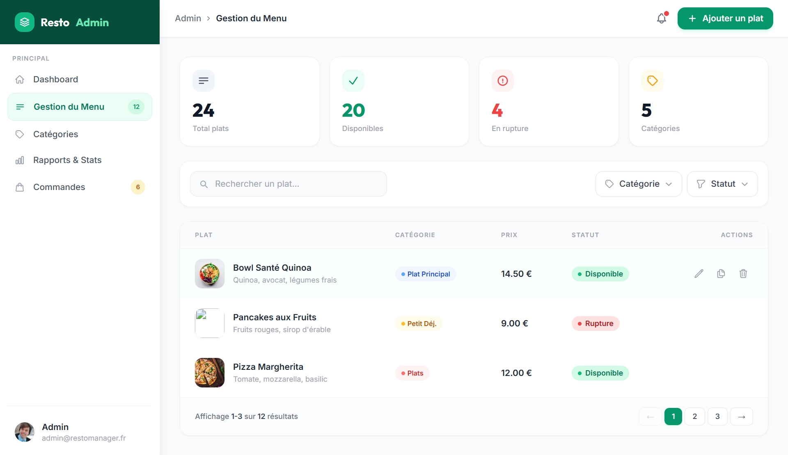
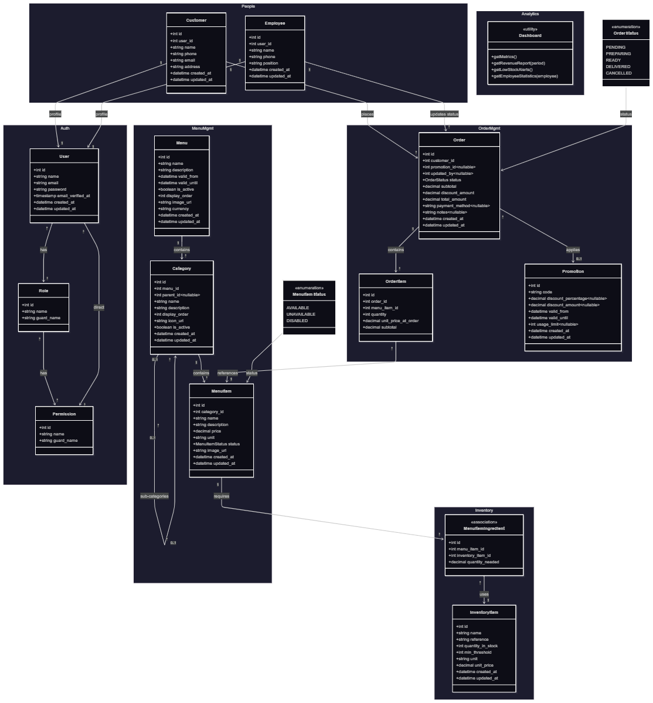

  
  

# Projet de Fin de Formation
### Digitalisation des Services de Mini Restaurant : Développement d’une Solution Web Intégrée de Gestion

**Réalisé par :** Mohamed Ouallou  
**Encadré par :** M. ESSARRAJ Fouad  
**Filière :** Développement Mobile et Web

---

## Sommaire

  

1

Contexte du projet

  

2

Méthodologie de travail

  

3

Branche Fonctionnelle

  

4

Branche Technique

  

5

Conception

  

6

Conclusion

---
## 1. Contexte du projet

  

---

## 2. Méthodologie : Design Thinking

  

---

## Méthodologie : Scrum (Agile)

  

---

## 3. Branche Fonctionnelle : Carte Empathie

  

---

## Branche Fonctionnelle : DÉFINITION

  <h4>Cadrage du problème</h4>
  <blockquote style="font-style: italic; background: white; padding: 15px; border-radius: 8px;">
    "Ses tâches sont réalisées manuellement via des outils dispersés comme WhatsApp et Excel, ce qui entraîne une perte de temps, un manque d’efficacité et une image professionnelle qui ne reflète pas son véritable niveau d’expertise."
  </blockquote>

---

## Branche Fonctionnelle : Cas d'utilisation

### Cas d'utilisation : Client

  

---

### Cas d'utilisation : Employé

  

---

### Cas d'utilisation : Admin

  

---

## Branche Fonctionnelle : Cas d'utilisation

### Sprint 1 : Gestion de Base

  

---

## Branche Fonctionnelle : Cas d'utilisation

### Sprint 2 : Nutrition

  

---

## Branche Fonctionnelle : Maquettes (UI/UX)

  
  
  

---

## 4. Branche Technique : Tech Stack

  
  

    <h4 style="text-align: center; border-bottom: 2px solid #029fcaff; padding-bottom: 8px;">Back-end & Architecture</h4>
    

        

            PHP • Laravel • MySQL
        

    

    <ul style="list-style: none; padding: 15px 0 0 0; font-size: 0.9em; border-top: 1px solid #eee;">
      <li><strong>Architecture :</strong> N-Tiers (Service Layer)</li>
      <li><strong>Spatie :</strong> Rôles & Permissions</li>
      <li><strong>Moteur :</strong> Eloquent ORM</li>
    </ul>
  

  

    <h4 style="text-align: center; border-bottom: 2px solid #27ae60; padding-bottom: 8px;">Front-end & Outils</h4> 
    

        

            Tailwind CSS • Alpine.js • Vite
        

    

    <ul style="list-style: none; padding: 15px 0 0 0; font-size: 0.9em; border-top: 1px solid #eee;">
      <li><strong>UI :</strong> Preline UI & Lucide Icons</li>
      <li><strong>Communication :</strong> AJAX / Axios</li>
      <li><strong>Assets :</strong> Vite Bundler</li>
    </ul>
  

---
## 5. Conception : Modélisation des données

 

---

## 7. Conclusion

### Merci pour votre attention !
**Questions ?**
