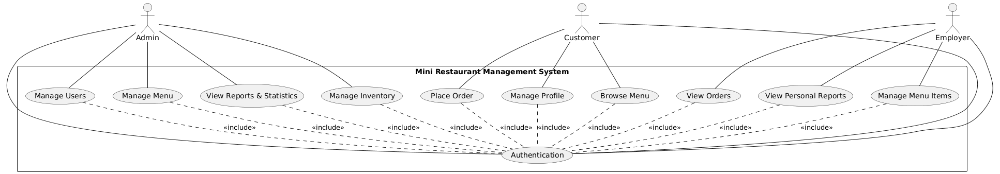
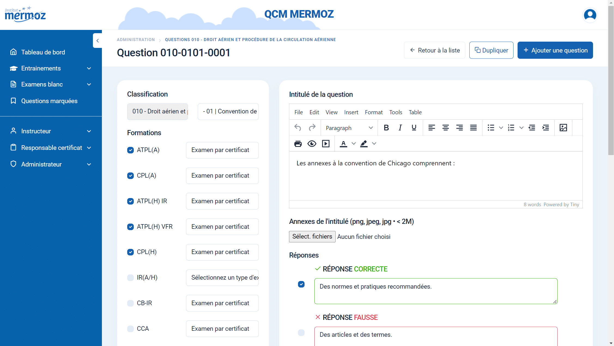
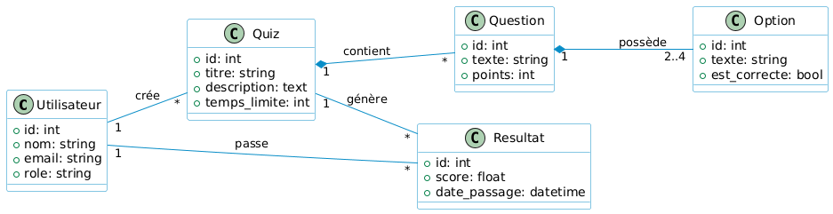

  
  

# **Projet de Fin de Formation**
### **Digitalisation des Services de Coaching : Développement d’une Solution Web Intégrée de Gestion et de Branding**

**Réalisé par :** Mohamed Ouallou
**Encadré par :** M. ESSARRAJ Fouad  
**Filière :** Développement Mobile et Web

---

## Sommaire

  

1

Contexte du projet

  

2

Méthodologie de travail

  

3

Branche Fonctionnelle

  

4

Branche Technique

  

5

Conception

  

6

Démonstration

  

7

Conclusion

---
## 1. Contexte du projet

  <h4>Contexte : </h4>
  <blockquote style="font-style: italic; background: white; padding: 15px; border-radius: 8px;">
    "Mr. Ayoube Jamali owns a small restaurant and is highly skilled in food preparation and customer service. However, he faces difficulties managing daily operations such as order organization, revenue tracking, and staff coordination, as most processes are handled manually.

This project aims to design a Mini Restaurant Management System that digitalizes operations, improves workflow efficiency, and enhances overall business performance."
  </blockquote>

---

## 2. Méthodologie : Design Thinking

  

---

## Méthodologie : Scrum (Agile)

  

---

## 3. Branche Fonctionnelle : Design Thinking
### 1. EMPATHIE

  

    <h4>Comprendre l'utilisateur</h4>
    <blockquote style="font-style: italic; background: white; padding: 15px; border-radius: 8px;">
      "Mr. Ayoube Jamali, owner of a small restaurant, struggles with daily operational management due to manual processes. This causes stress, order confusion during peak hours, and limits business efficiency. He needs a structured digital system to improve organization and performance."

#### Key Points
- Manual order management causes confusion  
- Revenue tracking is time-consuming and error-prone  
- No centralized system for menu and staff management  
- Need for real-time order tracking  
- Desire for a clear dashboard and better control .
    </blockquote>
  

---

## Branche Fonctionnelle : Design Thinking
### 2. DÉFINITION

  

    <h4>Cadrage du problème</h4>
    <blockquote style="font-style: italic; background: white; padding: 15px; border-radius: 8px;">

  - Manual management of daily operations (orders, revenue, menu, staff)  
  - Order confusion during peak hours  
  - Errors in revenue calculation  
  - Lack of real-time visibility on performance  
  - Poor menu organization  
  - Increased operational stress  
  - Absence of a centralized digital system limits efficiency, scalability, and performance
    </blockquote>
  

---

## Branche Fonctionnelle : Design Thinking
### 3. IDÉATION

  

    <h4>Solutions retenues</h4>
    
• Interface <strong>"Single Question"</strong> pour éviter la surcharge cognitive.

    
• <strong>Timer dynamique</strong> par catégorie de question.

    
• <strong>Dashboard</strong> temps réel pour le suivi des formateurs.

  

---

## Branche Fonctionnelle : Cas d'utilisation

  <h3>Interaction Utilisateur (UML)</h3>
  

---
## Branche Fonctionnelle : Maquettes (UI/UX)

  

    
  

---

## 4. Branche Technique : Tech Stack

  

    <h4>Les technologies à utiliser</h4>
    <ul>
      <li><strong>Base de données:</strong> MySQL</li>
      <li><strong>Framework:</strong> Laravel 12</li>
      <li><strong>Architecture N-Tiers:</strong>
        <ul style="margin-top: 5px;">
          <li>Controller: Requêtes HTTP</li>
          <li>Service: Logique métier</li>
          <li>Model: Base de données</li>
        </ul>
      </li>
      <li><strong>Architecture MVC</strong></li>
      <li><strong>Blade:</strong> Templates réutilisables</li>
    </ul>
  

  

    <ul>
      <li><strong>AJAX:</strong> Interactions dynamiques sans rechargement</li>
      <li><strong>Alpine.js:</strong> Librairie JavaScript dynamique</li>
      <li><strong>Spatie:</strong> Gestion permissions et rôles</li>
      <li><strong>Vite:</strong> Outil de build rapide</li>
      <li><strong>Lucide:</strong> Librairie d'icônes</li>
      <li><strong>Tailwind CSS:</strong> Développement responsive</li>
    </ul>
  

---

## 5. Conception : Diagramme de classe

<h3>Modélisation des données (MLD)</h3>

  

---

## 6. Démonstration : Environnement & Outils

  

    <h4>Environnement de Développement</h4>
    <ul>
      <li><strong>IDE:</strong> VS Code & Antigravity</li>
      <li><strong>Monitoring DB:</strong> Workbench SQL</li>
    </ul>
  

  

    <h4>Gestion & Déploiement</h4>
    <ul>
      <li><strong>Modélisation UML:</strong> Mermaid/PlantUML</li>
      <li><strong>Gestion de version:</strong> Git (GitHub)</li>
      <li><strong>Navigateur:</strong> Chrome DevTools</li>
    </ul>
  

---

## 7. Conclusion

### Merci pour votre attention !
