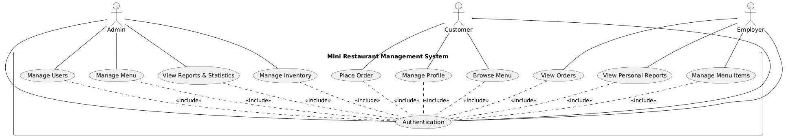
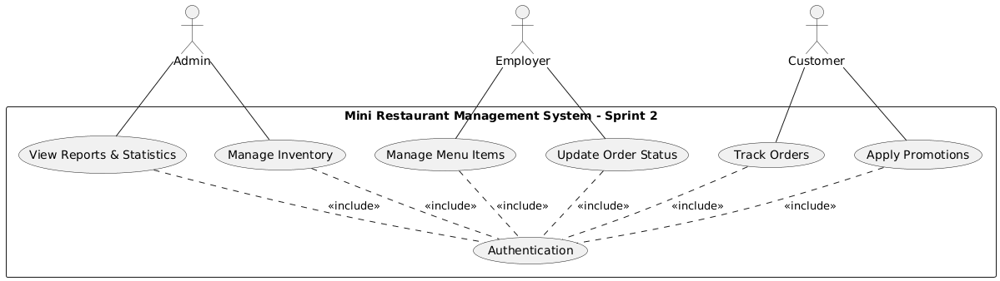
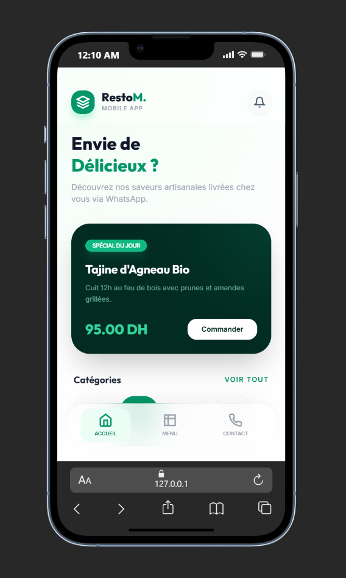
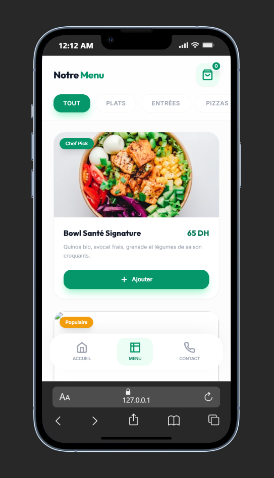

# Rapport de Projet de Fin d'Année
**Sujet :** Digitalisation des Services de Mini Restaurant : Développement d’une Solution Web Intégrée de Gestion  
**Filière :** Développement Mobile et Web  

**Présenté par :** Mohamed Ouallou  
**Encadrant :** M. ESSARRAJ Fouad  
**Année de Formation 2025/2026**

---

## Table des Matières

1. [Introduction Générale](#1-introduction-générale)
2. [Contexte du Projet](#2-contexte-du-projet)
    * 2.1 [Défis Opérationnels](#21-défis-opérationnels)
    * 2.2 [Objectifs de la Solution](#22-objectifs-de-la-solution)
3. [Définition du Problème](#3-définition-du-problème)
4. [Analyse d’Empathie & Branche Fonctionnelle](#4-analyse-dempathie--branche-fonctionnelle)
    * 4.1 [Profil : Le Propriétaire (Ayoube Jamali)](#41-profil--le-propriétaire-ayoube-jamali)
    * 4.2 [Profil : Le Client](#42-profil--le-client)
    * 4.3 [Profil : Le Personnel (Staff)](#43-profil--le-personnel-staff)
    * 4.4 [Synthèse de la Vision (Scalabilité)](#44-synthèse-de-la-vision-scalabilité)
5. [Idéation — Conception du Système](#5-idéation--conception-du-système)
    * 5.1 [Interface "Single Question" et Suivi Temps Réel](#51-interface-single-question-et-suivi-temps-réel)
    * 5.2 [Flux de Travail Digitalisé](#52-flux-de-travail-digitalisé)
6. [Architecture des Cas d’Utilisation (UML)](#6-architecture-des-cas-dutilisation-uml)
    * 6.1 [Les Acteurs du Système](#61-les-acteurs-du-système)
    * 6.2 [Détail des Cas d’Utilisation](#62-détail-des-cas-dutilisation)
    * 6.3 [Cas d’Utilisation Global](#63-cas-dutilisation-global)
7. [Planification Agile : Sprints et Cas d’Utilisation](#7-planification-agile--sprints-et-cas-dutilisation)
    * 7.1 [Sprint 1 : Fondations et Gestion des Ressources](#71-sprint-1--fondations-et-gestion-des-ressources)
    * 7.2 [Sprint 2 : Système Client et Commandes Temps Réel](#72-sprint-2--système-client-et-commandes-temps-réel)
8. [Branche Technique & Diagramme de Classe](#8-branche-technique--diagramme-de-classe)

---

## 1. Introduction Générale

Dans un secteur de la restauration de plus en plus compétitif, l'efficacité opérationnelle et la satisfaction client sont des piliers incontournables. Les petits restaurants doivent souvent faire face à d'importants défis de gestion, exacerbés par l'utilisation de méthodes manuelles.

**Mr. Ayoube Jamali**, propriétaire d'un mini-restaurant, possède une grande maîtrise de la préparation culinaire et du service client. Cependant, il rencontre des difficultés croissantes dans la gestion de ses opérations quotidiennes : organisation des commandes, suivi des revenus et coordination du personnel. La majorité de ces processus étant réalisés manuellement, cela limite son efficacité.

> [!CAUTION]
> **Problématique :** La gestion manuelle des opérations (commandes, rentrées financières, menu, personnel) engendre du stress, une confusion des commandes pendant les heures de pointe, des erreurs comptables et un manque de visibilité sur les performances réelles.

Ce projet vise à concevoir un **Mini Restaurant Management System** qui digitalise l'intégralité des opérations, fluidifie le flux de travail et améliore de façon globale la performance commerciale du restaurant.

---

## 2. Contexte du Projet

Le projet s'inscrit dans un besoin vital de modernisation des processus de travail de Mr. Ayoube Jamali. Son activité, bien que qualitative, est bridée par le temps perdu dans des tâches administratives et organisationnelles.

### 2.1 Défis Opérationnels
La gestion actuelle repose sur un fonctionnement manuel chronophage :
1. **Gestion des commandes :** Prise de commandes sur papier, causant des pertes d'informations et des retards.
2. **Suivi des revenus :** Calcul manuel des entrées, source d'erreurs et de perte de temps en fin de journée.
3. **Gestion du menu :** Organisation figée et difficulté de mise à jour en temps réel des ruptures de stock.
4. **Coordination :** Le personnel manque d'outils pour suivre les commandes en cours de préparation de manière fluide.

### 2.2 Objectifs de la Solution
Pour pallier ces manques, la solution envisagée doit impérativement permettre :
* **Une accélération et sécurisation** du traitement des commandes pour éviter toute confusion.
* **Une automatisation** du calcul des revenus pour une comptabilité fiable et immédiate.
* **Un contrôle en temps réel** du menu et des stocks de plats disponibles.
* **Une expérience client améliorée** via la commande en ligne et la réservation de tables.

---

## 3. Définition du Problème

Le modèle actuel (processus métiers manuels) montre de très claires limitations technologiques :
- Gestion manuelle des opérations quotidiennes (commandes, recettes, menu, employés).
- Absence de visibilité en temps réel limitant l'efficacité, la réactivité et la performance globale du restaurant.
- Le manque de système centralisé entrave les opportunités de croissance de l'entreprise.

---

## 4. Analyse d’Empathie & Branche Fonctionnelle

**Objectif :** Identifier les besoins critiques des utilisateurs pour transformer une gestion artisanale en une solution performante.

### 4.1 Profil : Le Propriétaire / Admin (Ayoube Jamali)
*L'artisan bloqué par des contraintes logistiques qui souhaite structurer son entreprise.*

* **Vision :** Disposer d'un contrôle global de l'activité pour se concentrer sur l'amélioration des produits et le développement commercial.
* **Points de Douleur (Pains) :**
    * **Stress des heures de pointe :** Difficulté à jongler entre la caisse, la cuisine et la salle.
    * **Manque de données :** Impossible de savoir d'un coup d'œil quel est le plat le plus vendu ou la marge réelle.
* **Gains Attendus :**
    * **Dashboard Central :** Suivi intuitif des opérations, statistiques et chiffre d'affaires.
    * **Contrôle asynchrone :** Gérer son menu, les statuts "disponible/rupture" en un clic.

### 4.2 Profil : Le Client
*Le consommateur exigeant, désireux d'un service rapide et sans frictions.*

* **Points de Douleur (Pains) :**
    * **Attente :** Trop de temps perdu avant de pouvoir consulter la carte ou passer commande.
    * **Expérience floue :** Ignorance du statut de sa commande ou de sa réservation de table.
* **Gains Attendus :**
    * **Menu interactif :** Accès digital fluide aux plats, avec prix et descriptions.
    * **Autonomie :** Possibilité de réserver sa table et passer sa commande facilement, avec notifications.

### 4.3 Profil : Le Personnel (Staff)
*Les acteurs de terrain, garants de la rapidité du service.*

* **Points de Douleur (Pains) :**
    * **Chaos informationnel :** Tickets perdus, ordres contradictoires.
* **Gains Attendus :**
    * **Interface épurée :** Une vue claire des commandes à préparer ("Single Question").
    * **Timer dynamique :** Pour prioriser les plats efficacement.

### 4.4 Synthèse de la Vision (Scalabilité)
Le système vise une digitalisation complète éliminant le papier. Le restaurant peut alors absorber plus d'affluence sans aucune perte d'information, instaurant un véritable **écosystème collaboratif** orienté vers le "temps réel".

---

## 5. Idéation — Conception du Système

### 5.1 Interface "Single Question" et Suivi Temps Réel
Plutôt que d'inonder le personnel d'informations complexes, l'interface du staff utilisera un paradigme **"Single Question"** pour éviter toute surcharge cognitive. Le système ne montre que ce qui doit être traité : "Quelle commande dois-je préparer maintenant ?".
Un **Timer dynamique** sera intégré par catégorie de question/commande pour maximiser l'efficacité.

### 5.2 Flux de Travail Digitalisé
1. Le Client parcourt le menu digital et valide sa commande (ou le personnel encaisse en direct).
2. L'interface du Staff (Cuisine/Service) s'actualise en temps réel via AJAX, avec un minuteur dédié.
3. Le statut de commande change (En attente -> Préparation -> Prêt).
4. Toutes les données financières alimentent instantanément le Dashboard de l'Admin.

---

## 6. Architecture des Cas d’Utilisation (UML)

Le système est structuré autour d'une architecture multi-acteurs sécurisée, gérée via le package Spatie sur Laravel pour attribuer chaque rôle.

### 6.1 Les Acteurs du Système
* **L'Administrateur (Ayoube Jamali) :** Accès total. Gère les utilisateurs (employés), le menu complet, l'inventaire et consulte les statistiques financières.
* **L'Employé (Staff) :** Accès opérationnel. Visualise les commandes en direct, participe à la gestion des plats disponibles.
* **Le Client :** Parcourt le catalogue, commande et réserve un espace.

### 6.2 Détail des Cas d’Utilisation
* **Commun à Admin et Employé :** Authentification sécurisée, consultations (liées à leurs droits).
* **Exclusif Admin :** Gérer les Utilisateurs, Gérer l'Inventaire, Voir les Rapports.
* **Exclusif Staff :** Voir les Rapports Personnels, Assister à la gestion des éléments du Menu.
* **Client :** Gérer son profil, Consulter le Menu, Passer une Commande.

### 6.3 Cas d’Utilisation Global

---

## 7. Planification Agile : Sprints et Cas d’Utilisation

### 7.1 Stratégie de Développement
Basé sur la méthode Agile Scrum, le développement est découpé en Sprints itératifs pour apporter de la valeur le plus tôt possible.
1. **MVP (Sprint 1) :** Mise en place de l'outil de gestion pour l'Admin et validation de la structure de base du Menu.
2. **Incréments de Valeur (Sprint 2) :** Intégration de la vue en temps réel du staff et ouverture de la plateforme commande/réservation aux clients.

---

### 7.2 Sprint 1 : Fondations et Gestion des Ressources
**Objectif :** Digitaliser le Menu et fournir à l'Admin un tableau de bord.

| Catégorie | ID | Cas d’Utilisation | Description |
| :--- | :--- | :--- | :--- |
| **Authentification** | UC1 | Se connecter | Accès sécurisé à l'interface Admin/Staff. |
| **Catalogue** | UC2 | Gestion Menu | CRUD plat, prix, catégories, et gestion de l'état (Rupture/Stock). |
| **Staff & Sécurité** | UC3 | Gestion Utilisateurs | Création des accès pour le personnel. |
| **Analyse** | UC4 | Dashboard | Vue globale sur les indicateurs de performance. |

---

### 7.3 Sprint 2 : Système Client et Commandes Temps Réel
**Objectif :** Transformer le menu numérique en un outil opérationnel de prise et gestion des commandes inter-acteur.

| Catégorie | ID | Cas d’Utilisation | Description |
| :--- | :--- | :--- | :--- |
| **Expérience Client** | UC5 | Consulter Menu | Vue client sur le catalogue de plats interactif. |
| **Expérience Client** | UC6 | Prise de Commande | Le client construit son panier et valide la commande. |
| **Logistique Staff** | UC7 | Voir Commandes | Interface AJAX single-question de traitement avec timers. |

---

## Maquettes (UI/UX)

{width=200px}
{width=200px}

---

## 8. Branche Technique & Diagramme de Classe

### 8.1 Environnement & Outils
L'application repose sur une architecture robuste s'appuyant sur l'écosystème **Laravel**.

*   **Framework Back-end:** Laravel 12 (Architecture MVC & N-Tiers).
*   **Base de Données:** MySQL.
*   **Front-end & Dynamique:** Tailwind CSS (Utilitaires & UI), Alpine.js, Blade Templates, requêtes AJAX actives.
*   **Autorisations & Sécurité:** Laravel Spatie Permissions.
*   **Outils de dev:** VS Code, Git/GitHub, Vite.

### 8.2 Diagramme de Classe (MLD)

La base de données relationnelle structure l'interaction entre Utilisateurs, Rôles, Catégories, Produits (Menu), Commandes et Réservations.

---

## Conclusion
Le **Mini Restaurant Management System** transcende l'organisation artisanale initiale pour la propulser vers une efficacité numérique mesurable. En résolvant l'engorgement administratif et logistique, cette plateforme libère **Mr. Ayoube Jamali** des contraintes répétitives de la gestion manuelle, tout en offrant à ses clients et à son personnel une expérience fluide, rapide et professionnelle.